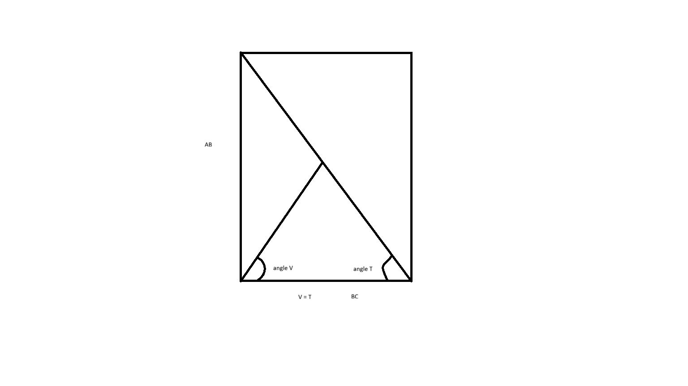

# Right triangle

This is an interesting challenge, where we need to find the angle formed by the altitude, starting from
the vertice where is located the 90 degrees angle, til the hypotenuse, in a way that the altitude cross
in the middle of the hypotenuse, dividing the hypotenuse in a half.

To solve this challenge, I used the concept of a right triangle as a half rectangle, cut by the diagonal.
If we draw a rectangle based on the right triangle, and draw the altitude, we can realize that the angle
we would like to find is equals to the angle opposite to the side `AB`:

To find the angle, we can use the following formula:

$$arcsin(AB/hypotenuse)$$
